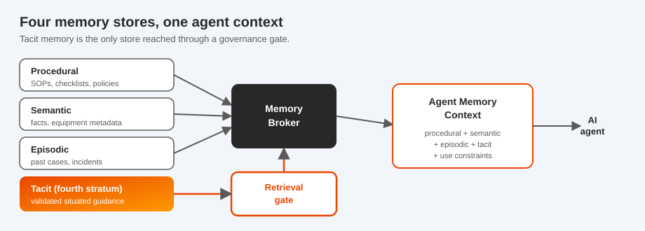

# About Metis

This page is the orientation and reference for the repository. For the pitch, the core concept,
and a runnable example, start with the [README](README.md). For depth on any topic, see the
[documentation index](docs/README.md).

## What Metis is

Metis is a local-first Python toolkit and reference architecture for capturing fragments of
human practice, governing them, and serving the validated ones to AI agents as memory the agent is
allowed to use. It implements the governed tacit-memory layer from the paper *Tacit Fragments:
Operationalising Tacit Knowledge as a Governed Memory Layer for Agentic AI*.

It records every step through [CHAP](https://github.com/BrightbeamAI/chap), the Collaborative
Human-Agent Protocol, so every capture, review, retrieval, escalation, and revocation is a
structured collaboration event on an append-only, hash-linked evidence chain.

## The four memory stores

Metis models the four kinds of memory an agent draws on, and keeps them distinct so an agent can
tell prescribed rules, general facts, past cases, and situated, governed guidance apart.

| Store | Holds | Access |
|-------|-------|--------|
| Procedural | SOPs, checklists, policies, prescribed sequences | direct |
| Semantic | concepts, facts, equipment and product metadata | direct |
| Episodic | past events, incidents, prior cases | direct |
| Tacit (the fourth stratum) | validated fragments of situated practice, with conditions, authority, consent, and use constraints | only through the retrieval gate |

Metis primarily builds this fourth stratum. A `MemoryBroker` assembles an `AgentMemoryContext` that
combines all four; tacit memory arrives only through the condition-aware gate, together with its
use constraints.

<p align="center"></p>

See [docs/memory_architecture.md](docs/memory_architecture.md) for the full model.

## Repository map

| Path | What is there |
|------|----------------|
| `metis/` | the toolkit: `fragment/`, `taxonomy/`, `conditions/`, `consent/`, `capture/`, `validation/`, `governance/`, `retrieval/`, `memory/`, `models/`, `audit/`, `storage/`, `cli/`, `api/`, `mcp/` (the MCP server), `integrations/chap/`, plus `engine.py`, `project.py` (local projects), `clock.py`, and `scenarios.py` |
| `examples/` | three runnable synthetic examples with inputs, contexts, and expected outputs ([index](examples/README.md)) |
| `docs/` | concept and reference docs, the MCP server guide, the visual `explainer.html`, and the interactive `demo.html` ([index](docs/README.md)) |
| `schemas/` | JSON Schemas for the core `tacit.*` objects, generated from the models |
| `profiles/` | the `metis/1.0` CHAP profile |
| `prompts/` | whisper templates for the in-flow categories (K2, K3, K5, K7, K9 to K12, K14) and model-assist prompt templates |
| `templates/` | capture canvas, Knowledge Audit, CDM and mini-CDM interview guides, review checklist, consent, promotion, retirement, and contestability records |
| `tests/` | pytest suite, runs without a live model |
| `scripts/` | `generate_schemas.py`, `generate_examples.py`, `build_demo.py` (with `demo_template.html`), `build_pypi_readme.py`, and `acceptance_check.py` |

## Local projects

The CLI and the MCP server keep their state in a local project (`./.metis`, or `$METIS_HOME`).
The optional FastAPI server, built for local exploration, runs one in-memory engine seeded with the
pump scenario and writes audit exports to the project's `exports/` directory.

| Path | Holds |
|------|-------|
| `chap.db` | the CHAP coordinator's SQLite store, with every workspace's evidence chain |
| `project.json` | the active workspace |
| `config.json` | the local model configuration (`metis config set ...`) |
| `workspaces/<id>/metis.db` | the workspace's fragments, memory objects, memory entries, and pending captures, in SQLite |
| `workspaces/<id>/evidence.jsonl` | an append-only ledger with one line per chain entry |
| `workspaces/<id>/.lock` | held by the one process writing the workspace |

Opening a workspace restores its chain and runs a quick check against the ledger; `metis audit
verify` compares the two entry for entry. One process writes a
workspace at a time; inspection and verification open it read-only alongside a running writer such
as `metis mcp`.

## How Metis relates to CHAP

CHAP provides workspaces, participants, tasks, artefacts, whisper, review, and control events, and
an append-only, hash-linked evidence chain, and Metis uses each of them. Metis depends on the
official `chap-coordinator` Python reference implementation. The adapter
(`metis/integrations/chap/`) drives a real Coordinator through JSON-RPC dispatch and reuses its
canonical JCS, identifier, and hashing primitives. A compliance test reads the method allow-list
straight from the Coordinator and checks every envelope Metis emits against it.
The `tacit.*` names are task and artefact kinds declared by the `metis/1.0` profile, which is how
CHAP is meant to be extended.

| Metis concept | CHAP concept |
|-------------------|--------------|
| Capture Cell | a workspace, created by the coordinator service, with human, agent, and group participants |
| Operator, Whisperer, Mission Group, reviewers | human, agent, and group participants; each reviewer joins as a named human |
| Tacit fragment, memory object, agent context | artefacts of kind `tacit.*` with a schema reference |
| Whisper, operator confirmation | `whisper.ask` / `whisper.answer` |
| Mission Group review | `review.request` under a `quorum:2` rule; approvals as `decide.approve`, a hold as `abstain.declare`, re-elicitation as `escalate.raise` |
| Escalation to a person | a `tacit.escalation` task assigned to the operator |
| Contest by a worker or reviewer | a `tacit.validation_event` artefact and a fresh Mission Group task |
| Revocation, supersession | `control.*` events plus records |
| Audit trail | hash-linked (JCS) evidence chain, kept in CHAP's SQLite store; Ed25519 signing available through CHAP's optional `security-signed/1.0` profile |

Full detail and the complete mapping are in [docs/chap_integration.md](docs/chap_integration.md), and
the profile is in [profiles/metis.md](profiles/metis.md).

## Local model runtime

Metis assists capture with a local model and calls no cloud API. It defaults to Ollama and the
Gemma family. The demo and the tests use deterministic fixtures, so they need no model server;
`metis demo --live-model` captures with the live model instead.

```bash
ollama pull gemma4
metis config set model.name gemma4
metis model check
```

Every model call made during capture is recorded as a `ModelAssistRecord`. Model output is an
advisory draft for people to accept or change; promotion, validation, retrieval, authorisation, and
revocation stay with people and the gate. See
[docs/local_model_runtime.md](docs/local_model_runtime.md).

## Develop

```bash
make dev        # editable install with the dev and api extras (dev includes mcp, build, twine)
make test       # pytest, no live model needed
make lint       # ruff
make demo       # the end-to-end local demo
make regen      # regenerate schemas, the interactive demo, and the example outputs
make verify     # lint, test, and acceptance check
```

The schemas, the demo page, and the example expected outputs are generated from the code, and
`make regen` rebuilds them. A test fails when a committed schema differs from its model, and a
parity test runs the demo page's gate against the Python gate (it needs Node.js).
`scripts/acceptance_check.py` checks the project against its acceptance criteria.

To release to PyPI, run `make build` (it writes the PyPI README, builds the sdist and wheel, and
checks them with twine), then `make publish` with a PyPI token. The distribution is
`metis-memory`; the import package and CLI are `metis`.

## Scope

Metis is a reference toolkit for research and practitioner pilots. It captures, governs, and serves
tacit fragments, and leaves authentication, multi-tenant deployment, and production quality
management to the systems around it. Capture is consented and visible to the worker: Metis records
no audio, video, biometrics, screenshots, or keystrokes. Retrieval decides from recorded
conditions, consent, and authority. See [ETHICAL_USE.md](ETHICAL_USE.md).

## Documentation

The [documentation index](docs/README.md) links the concept and reference docs: architecture, the
memory model, the governance model, condition-aware retrieval, the K1 to K17 taxonomy, the
`metis/1.0` profile, the CHAP integration, agent memory use, the MCP server, and the local model
runtime. JSON Schemas are in [schemas/](schemas/), the runnable examples in
[examples/](examples/), and the capture and review templates in [templates/](templates/).

## License

Apache-2.0. See [LICENSE](LICENSE).
