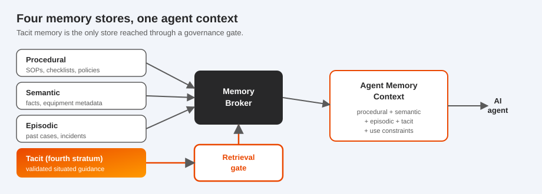

<p align="center">
  
</p>

<h1 align="center">TacitFlow</h1>

<p align="center"><b>Capture how expert work actually gets done, govern it, and serve it to AI agents as memory they are allowed to use.</b></p>

<p align="center">
  
  
  
  
  
</p>

---

TacitFlow is a local-first Python toolkit for **governed tacit fragment capture**. It turns a
situated work observation (a cue an operator acts on, a timing they adjust, a "looks off" they
catch) into a partial, validated, context-bound fragment, then into a governed memory object an AI
agent can retrieve only through an explicit governance gate.

It is a working reference implementation of "the fourth stratum" from the paper *The Fourth Stratum:
Tacit Knowledge as a Governed Memory Layer for Agentic AI*. It runs entirely on your machine, uses a
local Ollama model (Gemma) for bounded drafting help, and records every step on a signed,
append-only CHAP evidence chain. It runs on CHAP (the Collaborative Human-Agent Protocol,
<https://github.com/BrightbeamAI/chap>) so capture, review, retrieval, and revocation are structured
collaboration events, not ad hoc logs.

<p align="center"></p>

## Quickstart (about 30 seconds, no cloud, no GPU)

```bash
git clone https://github.com/BrightbeamAI/tacitflow && cd tacitflow
pip install -e .
tacitflow demo manufacturing-pump-vibration
```

The demo prints a 19 step walkthrough and writes a replayable evidence chain. Then inspect it:

```bash
tacitflow fragment list
tacitflow memory list
tacitflow retrieve --context examples/manufacturing_pump_vibration/context_matching.json      # allowed
tacitflow retrieve --context examples/manufacturing_pump_vibration/context_non_matching.json  # blocked, with a reason
tacitflow audit read
```

Prefer to click through it? Open the **[interactive demo](docs/demo.html)**: pick a scenario, step
through the loop, and drive the retrieval gate yourself. For a guided tour, open the illustrated
**[explainer](docs/explainer.html)**. You can also run `tacitflow demo manufacturing-pump-vibration --open`.

## Use it in practice (Python)

```python
from tacitflow import TacitFlowEngine
from tacitflow.conditions.context import TacitContext
from tacitflow.consent.model import ConsentRecord, ConsentStatus

eng = TacitFlowEngine()             # local and deterministic, no cloud APIs
eng.join_default_participants()

# 1. Capture a situated observation through Observe to Remember.
result = eng.capture_observation(
    {
        "observation_id": "OBS-1",
        "work_as_imagined": "Reduce load only when the alarm threshold is crossed.",
        "work_as_done": "Reduce throughput earlier on low-frequency vibration and a dull acoustic cue.",
        "context": TacitContext(equipment_family="centrifugal_pump", operating_mode="high_load"),
    },
    consent=ConsentRecord(consent_status=ConsentStatus.granted),
    category="K7_sensory",
)
fragment = result.fragment          # lands in the Evidence layer, not yet usable

# 2. A Mission Group promotes it. This is a human, deterministic decision.
eng.tier2_review(fragment.fragment_id, "promoted_to_advisory",
                 summary="Recurs across cases, advisory cue only.")

# 3. An agent asks for memory under a runtime context. Tacit memory passes the gate.
ctx = TacitContext(equipment_family="centrifugal_pump", operating_mode="high_load", risk_class="moderate")
agent_ctx = eng.agent_context("tsk_42", ctx)
for entry in agent_ctx.tacit_memory:
    print(entry.content)
    print(entry.use_constraints)     # the agent must respect these
```

Change the runtime context (a different pump, a high risk class, a withdrawn consent) and the same
fragment is withheld, with a recorded reason. That is the whole point.

## How it works

**Capture loop.** Observe a work event, Infer a candidate (a hypothesis, never trusted), Whisper a
short bounded question to the worker, Confirm with them (Tier-1, descriptive fidelity only), and
Remember the result as an Evidence-layer fragment.

**Governance.** A Mission Group runs Tier-2 review across fidelity, operational relevance, normative
alignment, and risk, then promotes the fragment to Advisory or Controlled, or holds, rejects, or
re-elicits it. Evidence-layer fragments can never drive a decision or reach an agent. A local model
can draft a review summary, but it never makes the decision.

**Memory and retrieval.** A promoted fragment becomes a `TacitMemoryObject`. A `MemoryBroker`
assembles an `AgentMemoryContext` that combines procedural, semantic, episodic, and tacit memory, and
tacit memory is reached only through a condition-aware gate that carries the use constraints with it.

<p align="center"></p>

<p align="center"></p>

## Command-line interface

```bash
tacitflow init                                   # create a local project (.tacitflow/)
tacitflow demo <scenario>                        # run a full local walkthrough
tacitflow capture --example <scenario>           # run the capture loop for a synthetic example
tacitflow fragment list | show <id>              # inspect captured fragments
tacitflow memory list | show <id>                # inspect governed tacit memory
tacitflow memory query --context <file.json>     # build an AgentMemoryContext
tacitflow retrieve --context <file.json>         # run the gate against a runtime context
tacitflow audit read | export --out evidence.jsonl
tacitflow model check | pull gemma4 | run --prompt "..."
tacitflow config set model.provider ollama
```

Scenarios: `manufacturing-pump-vibration`, `batch-quality-visual-inspection`, `shift-handover-gap`.

## Local model (optional)

TacitFlow assists capture with a local model and never calls a cloud API. The demo and the tests run
without any model using deterministic fixtures. To use a real local model:

```bash
# install Ollama from https://ollama.com, then:
ollama pull gemma4
tacitflow config set model.name gemma4
tacitflow model check
```

Model output is always an advisory draft, recorded as a `ModelAssistRecord`. It can never promote,
validate, retrieve, authorise, or revoke a fragment. See [docs/local_model_runtime.md](docs/local_model_runtime.md).

## Repository map

| Path | What is there |
|------|----------------|
| `tacitflow/` | the toolkit: `fragment/`, `taxonomy/`, `conditions/`, `consent/`, `capture/`, `validation/`, `governance/`, `retrieval/`, `memory/`, `models/`, `audit/`, `storage/`, `cli/`, `api/`, `integrations/chap/`, plus `engine.py` and `scenarios.py` |
| `examples/` | three runnable synthetic examples with inputs, contexts, and expected outputs ([index](examples/README.md)) |
| `docs/` | concept and reference docs, plus the visual `explainer.html` ([index](docs/README.md)) |
| `schemas/` | JSON Schemas for every `tacit.*` object |
| `profiles/` | the `tacitflow/1.0` CHAP profile |
| `prompts/` | whisper templates (K2 to K14) and model-assist prompt templates |
| `templates/` | capture canvas, review checklist, consent and revocation records |
| `tests/` | pytest suite, runs without a live model |
| `scripts/` | `acceptance_check.py`, `generate_examples.py` |

## How TacitFlow relates to CHAP

TacitFlow does not define a protocol. It runs on **CHAP** (<https://github.com/BrightbeamAI/chap>),
which gives it workspaces, participants, tasks, artefacts, whisper and review and control events, and
a signed hash-linked evidence chain. Because CHAP ships as TypeScript, TacitFlow includes a Python
adapter (`tacitflow/integrations/chap/`) that emits and validates CHAP-compatible records rather than
re-implementing the protocol. Details and the full mapping are in [docs/chap_integration.md](docs/chap_integration.md).

## Develop

```bash
make dev      # editable install with dev and api extras
make test     # pytest, no live model needed
make lint     # ruff
make demo     # the end-to-end local demo
python scripts/acceptance_check.py
```

## Ethical use

TacitFlow captures fragments of human work. Do not use it for covert worker monitoring. It records no
audio, video, biometrics, screenshots, or keystrokes, fragments are never treated as fact, and the
audit chain is append-only. Production use needs worker consultation, legal review, and domain
validation. Read [ETHICAL_USE.md](ETHICAL_USE.md) first.

## Documentation and license

Start at [docs/README.md](docs/README.md), the visual [explainer](docs/explainer.html), and the
interactive [demo](docs/demo.html). The explainer and demo are static HTML: open them locally, or
enable GitHub Pages (a workflow is included in `.github/workflows/pages.yml`) to host them, after
which they are served from the `docs/` folder. If you use TacitFlow in research, please also cite
the paper *The Fourth Stratum: Tacit Knowledge as a Governed Memory Layer for Agentic AI*. Licensed
under Apache-2.0 ([LICENSE](LICENSE)).
