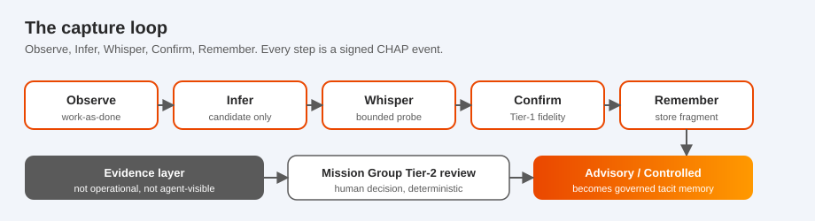
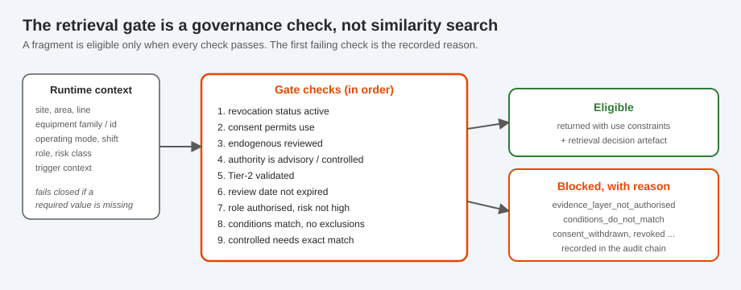

<p align="center">
  
</p>

<h1 align="center">TacitFlow: Governed Tacit Memory for AI Agents</h1>

<p align="center"><b>Capture how expert work actually gets done, govern it, and serve it to AI agents as memory they are allowed to use.</b></p>

<p align="center">
  
  
  
  
  
</p>

---

AI agents now act inside real workflows, but the knowledge that makes work go right was often never
written down. A technician hears a pump sounds wrong before any alarm. An inspector sees a batch
"looks off" before the lab confirms it. Manuals do not capture this, and naively mining it from
workers is unsafe and easy to get wrong.

TacitFlow is a local-first Python toolkit that captures these moments as **governed tacit
fragments**, has a human group validate them, and serves only the validated ones to an AI agent,
under the exact conditions where they hold, with a full audit trail. It implements the governed
tacit-memory layer from the paper *Operationalising Tacit Knowledge as a Governed Memory Layer for
Agentic AI*, and it runs on [CHAP](https://github.com/BrightbeamAI/chap) so every step is recorded
on a hash-linked, replayable evidence chain.

<p align="center"></p>

## What is a tacit fragment?

Most of what makes someone good at their job never reaches a document. A tacit fragment is a small,
structured, governed record of one such piece of practice. It is deliberately partial: it is not a
worker's whole expertise, and it is never treated as fact.

Every fragment carries the things that make it safe to reuse:

- **what** was observed and worker-confirmed, and its category (the K1 to K17 taxonomy of tacit knowledge),
- **the conditions** under which it applies (site, equipment, operating mode, shift, role, risk, and exclusions),
- **where it came from**: provenance, the worker, and their consent,
- **the evidence** behind it (recurrence, supporting cases, counterexamples),
- **an authority layer**: Evidence (learning only), Advisory (conditional guidance), or Controlled (formal instruction),
- **use constraints** that travel with it.

That structure is the point. A document chunk has no conditions, consent, or authority, and a
training example is treated as ground truth. A tacit fragment is neither. It is situated guidance an
agent may use only where it applies, and must stop using the moment it does not.

## A concrete example

A pump SOP says: reduce load only when the alarm threshold is crossed. Experienced operators reduce
throughput earlier, when high load coincides with low-frequency vibration and a dull acoustic cue.
TacitFlow captures that gap, a human group promotes it to an advisory cue, and an agent can then use
it, but only on the right pump in the right state.

```python
from tacitflow import TacitFlowEngine
from tacitflow.conditions.context import TacitContext
from tacitflow.consent.model import ConsentRecord, ConsentStatus

eng = TacitFlowEngine()              # local and deterministic, no cloud APIs
eng.join_default_participants()

# Capture what the operator does that the SOP does not say.
frag = eng.capture_observation(
    {
        "observation_id": "OBS-1",
        "work_as_imagined": "Reduce load only when the alarm threshold is crossed.",
        "work_as_done": "Reduce throughput earlier on low-frequency vibration and a dull acoustic cue.",
        "context": TacitContext(equipment_family="centrifugal_pump", operating_mode="high_load"),
    },
    consent=ConsentRecord(consent_status=ConsentStatus.granted),
    category="K7_sensory",
).fragment                            # lands in the Evidence layer, not yet usable

# A human Mission Group promotes it. A model never makes this call.
eng.tier2_review(frag.fragment_id, "promoted_to_advisory", summary="advisory cue only")

# An agent asks for guidance. The gate returns it only when the context matches.
match = TacitContext(equipment_family="centrifugal_pump", operating_mode="high_load", risk_class="moderate")
other = TacitContext(equipment_family="gear_pump", operating_mode="low_load", risk_class="moderate")

print(len(eng.retrieve(match).eligible))      # 1  (returned, with its use constraints)
print(eng.retrieve(other).blocked[0].reason)  # conditions_do_not_match
```

Change the pump, raise the risk class, or withdraw consent, and the same fragment is withheld with a
recorded reason. Retrieval is a governance decision, not a similarity search.

<p align="center"></p>

## Quickstart

No cloud and no GPU. The demo and tests run without any model using deterministic fixtures.

```bash
git clone https://github.com/BrightbeamAI/tacitflow && cd tacitflow
pip install -e .
tacitflow demo manufacturing-pump-vibration
```

The demo runs the whole flow locally and writes a replayable evidence chain. Inspect it with
`tacitflow fragment list`, `tacitflow memory list`, `tacitflow retrieve --context <file>`, and
`tacitflow audit read`.

Prefer to click through it? Open the **[interactive demo](docs/demo.html)**: pick a scenario, step
through the loop, and drive the gate yourself by editing the context and watching it allow or block.
For a guided tour, open the illustrated **[explainer](docs/explainer.html)**.

## How it works

**Capture loop.** Observe a work event, infer a candidate (a hypothesis, never trusted), whisper one
short bounded question to the worker, confirm with them (descriptive fidelity only), and remember the
result as an Evidence-layer fragment.

**Governance.** A human Mission Group reviews each fragment across fidelity, operational relevance,
normative alignment, and risk, then promotes it to Advisory or Controlled, or holds, rejects, or
re-elicits it. Evidence-layer fragments can never drive a decision or reach an agent. A local model
may draft a review summary, but it never decides.

**Memory and retrieval.** A promoted fragment becomes a governed memory object. A broker assembles an
agent context from procedural, semantic, episodic, and tacit memory, and tacit memory is reached only
through the condition-aware gate, which carries the use constraints with it.

## Learn more

- **[Interactive demo](docs/demo.html)** and **[explainer](docs/explainer.html)**: the fastest way to get it.
- **[Documentation](docs/README.md)**: architecture, governance, retrieval, the K1 to K17 taxonomy, agent use.
- **[ABOUT.md](ABOUT.md)**: repository map, the four memory stores, the CHAP relationship, and how to develop.
- **[CHAP](https://github.com/BrightbeamAI/chap)**: the protocol TacitFlow runs on.

## Ethical use

TacitFlow captures fragments of human work. Do not use it for covert worker monitoring. It records no
audio, video, biometrics, screenshots, or keystrokes, fragments are never treated as fact, and the
audit chain is append-only. Production use needs worker consultation, legal review, and domain
validation. Read [ETHICAL_USE.md](ETHICAL_USE.md) first.

## License

Apache-2.0. See [LICENSE](LICENSE). If you use TacitFlow in research, please also cite
*Operationalising Tacit Knowledge as a Governed Memory Layer for Agentic AI*.
