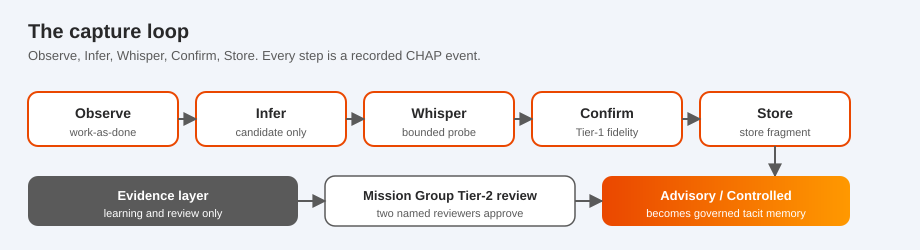
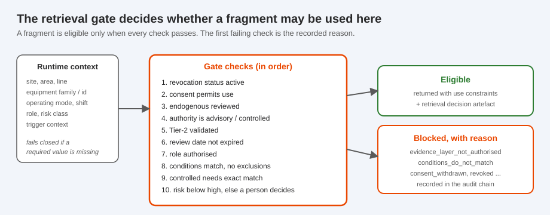

<p align="center">
  
</p>

<h1 align="center">Metis: Governed Tacit Memory for AI Agents</h1>

<p align="center"><b>Capture how expert work actually gets done, govern it, and serve it to AI agents as memory they are allowed to use.</b></p>

<p align="center">
  
  
  
  
  
</p>

---

AI agents now act inside real workflows, yet much of the knowledge that makes work go right was
never written down. A technician hears a pump sounds wrong before any alarm. A quality specialist
sees a batch "looks off" before the lab confirms it. Manuals miss this, and mining it from workers
without care is unsafe and easy to get wrong.

Metis is a local-first Python toolkit that captures these moments as **governed tacit
fragments**, has named human reviewers validate them, and serves only the validated ones to an AI
agent, under the exact conditions where they hold, with a full audit trail. It implements the
governed tacit-memory layer from the paper *Tacit Fragments: Operationalising Tacit Knowledge as a
Governed Memory Layer for Agentic AI*. Every capture, review, and retrieval decision is recorded
through the [CHAP](https://github.com/BrightbeamAI/chap) reference coordinator
(`chap-coordinator`), on a hash-linked, replayable evidence chain.

<p align="center"></p>

## What is a tacit fragment?

Much of what makes someone good at their job never reaches a document. A tacit fragment is a small,
structured, governed record of one such piece of practice. It is deliberately partial: one cue, one
adjustment, or one judgement, held as a claim that people can check and challenge.

Every fragment carries the things that make it safe to reuse:

- **what** was observed and worker-confirmed, and its category (the K1 to K17 taxonomy of tacit knowledge),
- **the conditions** under which it applies (site, equipment, operating mode, shift, role, risk, and exclusions),
- **where it came from**: provenance, the worker, and their consent,
- **the evidence** behind it (recurrence, supporting cases, counterexamples), and a confidence derived from that evidence,
- **an authority layer**: Evidence (learning only), Advisory (conditional guidance), or Controlled (formal instruction),
- **use constraints** that travel with it, and a review date.

That structure is the point. The conditions say where a fragment applies, consent says whether it
may be used at all, and the authority layer says what it may do. Together they make a fragment
situated guidance: an agent may use it where it applies, and the gate withholds it everywhere else.

## A concrete example

A pump SOP says: reduce load only when the alarm threshold is crossed. Experienced operators reduce
throughput earlier, when high load coincides with low-frequency vibration and a dull acoustic cue.
Metis captures that gap, two reviewers promote it to an advisory cue, and an agent can then use it
on the right pump in the right state.

```python
from metis import MetisEngine
from metis.conditions.context import TacitContext
from metis.consent.model import ConsentRecord, ConsentStatus

eng = MetisEngine()              # local and deterministic
eng.join_default_participants()

# Capture what the operator does that the SOP does not say.
frag = eng.capture_observation(
    {
        "observation_id": "OBS-1",
        "work_as_imagined": "Reduce load only when the alarm threshold is crossed.",
        "work_as_done": "Reduce throughput earlier on low-frequency vibration and a dull acoustic cue.",
        "context": TacitContext(equipment_family="centrifugal_pump", operating_mode="high_load"),
    },
    consent=ConsentRecord(consent_status=ConsentStatus.granted),
    category="K7_sensory",
).fragment                            # lands in the Evidence layer, invisible to agents

# Two named Mission Group reviewers promote it (the default quorum).
eng.tier2_review(frag.fragment_id, "promoted_to_advisory", summary="advisory cue only",
                 decided_by=["human:quality-lead@metis.local", "human:process-engineer@metis.local"])

# An agent asks for guidance. The gate returns it only when the context matches.
match = TacitContext(equipment_family="centrifugal_pump", operating_mode="high_load", risk_class="moderate")
other = TacitContext(equipment_family="gear_pump", operating_mode="low_load", risk_class="moderate")

print(len(eng.retrieve(match).eligible))      # 1  (returned, with its use constraints)
print(eng.retrieve(other).blocked[0].reason)  # conditions_do_not_match
```

Change the pump or withdraw consent, and the same fragment is withheld with a recorded reason. Raise
the risk class to high, and Metis opens an escalation task so a person decides. Retrieval is a
governance decision, made from recorded conditions, consent, and authority.

<p align="center"></p>

## Quickstart

Metis runs on a laptop. The demo and tests use deterministic fixtures, so they need no model server.

```bash
git clone https://github.com/BrightbeamAI/metis && cd metis
pip install -e .
metis demo manufacturing-pump-vibration
```

The installable package name is `metis-memory` (import `metis`, CLI `metis`). The official
[`chap-coordinator`](https://pypi.org/project/chap-coordinator/) dependency installs from PyPI
automatically.

The demo runs the whole flow and records it in a workspace of a local project (`./.metis`, or
`$METIS_HOME`).
The project keeps the CHAP chain in SQLite, each workspace's fragments and memory in its own SQLite
store, and an append-only evidence ledger, so every later command continues the same chain. Inspect
it with `metis fragment list`, `metis memory list`, `metis retrieve --context <file>`,
`metis audit read`, and `metis audit verify`. Each run of a scenario gets its own workspace
(`metis workspace list`).

Prefer to click through it? Open the **[interactive demo](docs/demo.html)**: pick a scenario, step
through the loop, and drive the gate yourself by editing the context and watching it allow or block.
For a guided tour, open the illustrated **[explainer](docs/explainer.html)**.

## How it works

**Capture loop.** Observe a work event, infer a candidate hypothesis, whisper one short question to
the worker, confirm the wording with them (Tier-1), and store the result as an Evidence-layer
fragment. The worker answers in their own words, under their own identity, and states consent with
the answer. Whispers are rationed per worker.

**Governance.** Named Mission Group reviewers weigh each fragment's fidelity, operational relevance,
normative alignment, and risk. Promotion to Advisory or Controlled needs a quorum of reviewers (two
by default, enforced by CHAP), sets a review date, and recomputes confidence from the evidence; one
reviewer can hold, reject, or ask for re-elicitation. A fragment in use can go back for re-review
at any time, after a contest or when its review date comes due. Evidence-layer fragments stay with
reviewers, out of agents' reach. A local model may draft a review summary; the reviewers decide.

**Memory and retrieval.** A promoted fragment becomes a governed memory object. A broker assembles an
agent context from procedural, semantic, episodic, and tacit memory, and tacit memory arrives only
through the condition-aware gate, with its use constraints. When a situation is high risk, or a
fragment matches the equipment and the situation differs, Metis opens an escalation task and a
person decides.

**Audit.** Every capture, review, retrieval, escalation, and contest is an entry on the CHAP
evidence chain. `metis audit verify` replays the chain and checks it against the ledger.

**For agents.** `metis mcp` serves the same governed memory to any MCP client, such as Claude
Desktop or Claude Code. See the [MCP server guide](docs/mcp_server.md).

## Learn more

- **[Interactive demo](docs/demo.html)** and **[explainer](docs/explainer.html)**: the fastest way to get it.
- **[Documentation](docs/README.md)**: architecture, governance, retrieval, the K1 to K17 taxonomy, agent use.
- **[ABOUT.md](ABOUT.md)**: repository map, the four memory stores, the CHAP relationship, and how to develop.
- **[MCP server](docs/mcp_server.md)**: connect an agent to governed tacit memory.
- **[CHAP](https://github.com/BrightbeamAI/chap)**: the Collaborative Human-Agent Protocol, whose reference coordinator records Metis's evidence.

## Ethical use

Metis captures fragments of human work, with the worker's knowledge and consent. Do not use it for
covert worker monitoring. It records no audio, video, biometrics, screenshots, or keystrokes;
fragments stay open to challenge; and the audit chain is append-only. Production use needs worker
consultation, legal review, and domain validation. Read [ETHICAL_USE.md](ETHICAL_USE.md) first.

## License

Apache-2.0. See [LICENSE](LICENSE).

## Citation

Metis is the reference implementation for the paper *Tacit Fragments: Operationalising Tacit
Knowledge as a Governed Memory Layer for Agentic AI*
([preprint](https://doi.org/10.20944/preprints202608.0927.v1), also included in this repository as
[docs/tacit_fragments_preprint.pdf](docs/tacit_fragments_preprint.pdf)). If you use Metis in
research, please cite:

```bibtex
@article{shahid2026tacitfragments,
  title   = {Tacit Fragments: Operationalising Tacit Knowledge as a Governed Memory Layer for Agentic AI},
  author  = {Shahid, Arsalan and Suttie, Gordon and Black, Philip and Garz{\'o}n-Vico, Antonio},
  journal = {Preprints},
  year    = {2026},
  doi     = {10.20944/preprints202608.0927.v1},
  url     = {https://doi.org/10.20944/preprints202608.0927.v1}
}
```
