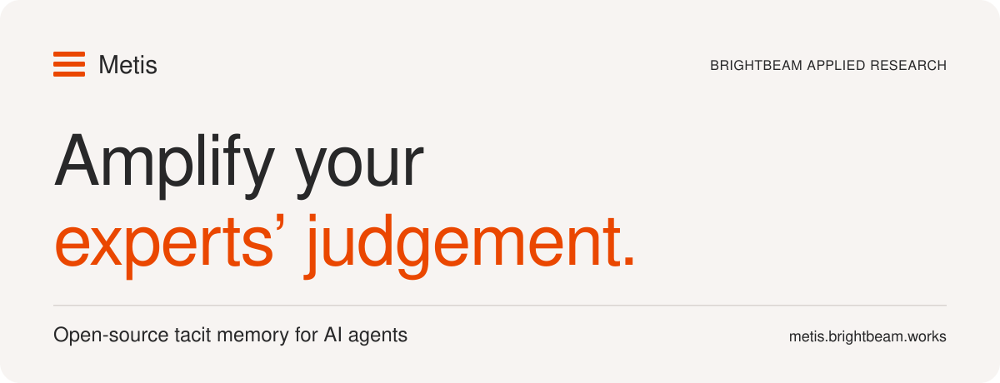
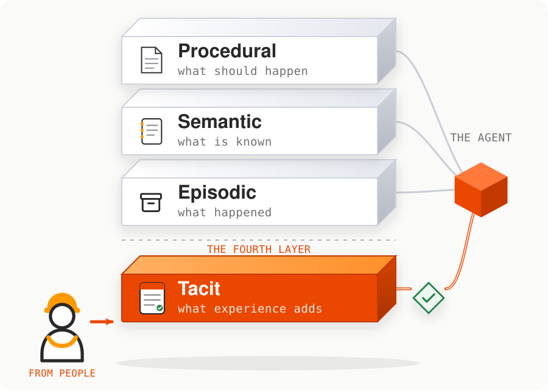
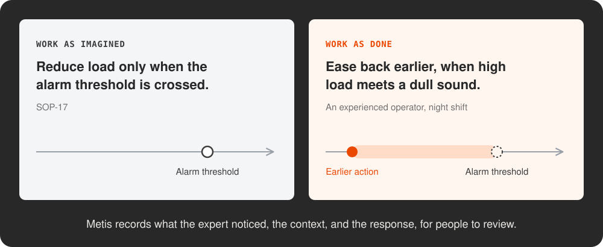
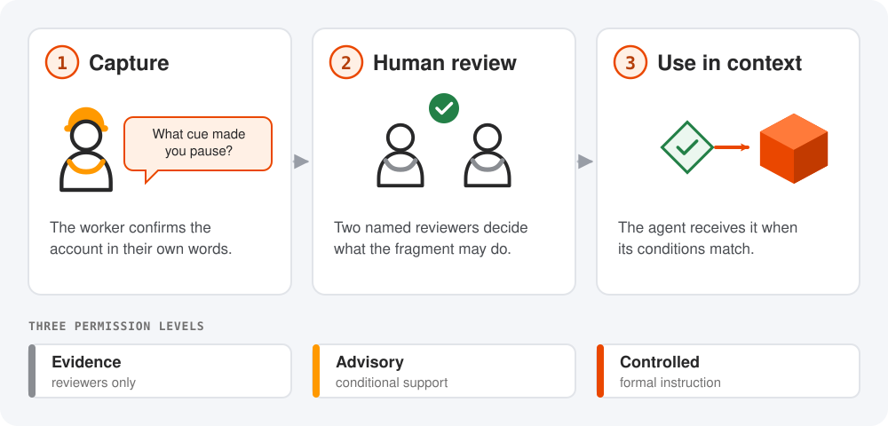
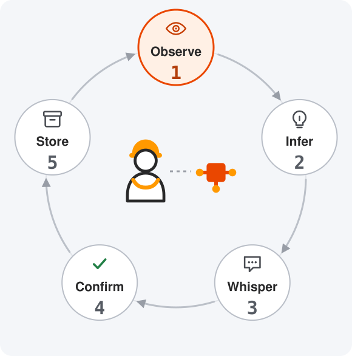
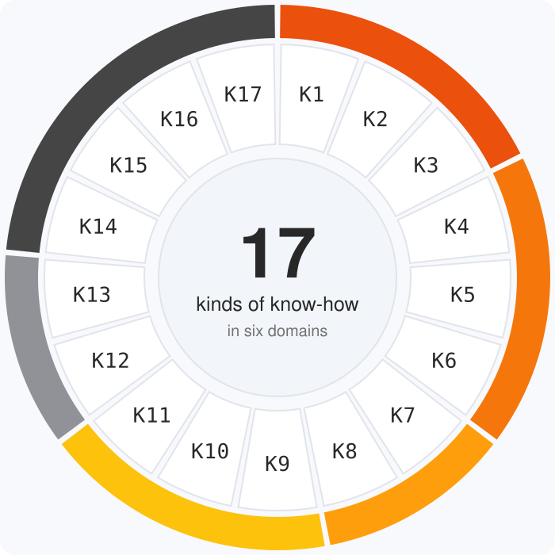

<p align="center">
  
</p>

<p align="center">
  <a href="https://metis.brightbeam.works"><b>Website</b></a> ·
  <a href="docs/README.md"><b>Documentation</b></a> ·
  <a href="https://doi.org/10.20944/preprints202608.0927.v1"><b>Paper</b></a> ·
  <a href="https://pypi.org/project/metis-memory/"><b>PyPI</b></a> ·
  <a href="https://github.com/BrightbeamAI/chap"><b>CHAP</b></a>
</p>

<p align="center">
  <a href="https://pypi.org/project/metis-memory/"></a>
  
  
  
</p>

**Metis** is an open-source toolkit for capturing fragments of expert practice and making them
available to AI agents as memory, with human review and agreed conditions for use.

## Tacit fragments: a fourth layer of agent memory

A **tacit fragment** records what an expert noticed, how they responded, and the circumstances of
that response. After human review, it sits alongside procedures, facts, and past events in the
agent's memory.

<p align="center">
  
</p>

## The gap between procedure and practice

Procedures describe what should happen, and logs record what happened. The cue behind an expert's
decision, and the reason for it, often go unrecorded.

<p align="center">
  
</p>

## How a fragment reaches an agent

<p align="center">
  
</p>

Every capture, confirmation, review decision, and retrieval is recorded through the
[CHAP](https://github.com/BrightbeamAI/chap) reference coordinator,
[`chap-coordinator`](https://pypi.org/project/chap-coordinator/), on a hash-linked evidence chain.

### The capture loop

When a recorded action differs from the procedure, a capture agent asks the expert one short
question, a *whisper*, and the expert confirms the account in their own words.

<p align="center">
  
</p>

## Seventeen kinds of know-how

Each fragment carries one of the paper's seventeen categories of tacit knowledge, K1 to K17. The
[atlas on the website](https://metis.brightbeam.works/#gap) gives an example of each and a way to
capture it.

<p align="center">
  
</p>

## Quickstart: run the pump example

```bash
python -m pip install metis-memory
metis demo manufacturing-pump-vibration
metis fragment list
metis memory list
metis audit verify
```

The demo uses supplied observations, needs no model server, and keeps its records in `./.metis`.
To work from source:

```bash
git clone https://github.com/BrightbeamAI/metis && cd metis
pip install -e .
```

<details>
<summary><b>Python example</b>: capture, review, and the condition-aware gate</summary>

```python
from metis import MetisEngine
from metis.conditions.context import TacitContext
from metis.consent.model import ConsentRecord, ConsentStatus

eng = MetisEngine()  # local and deterministic
eng.join_default_participants()

# Capture the operator's practice where it departs from the procedure.
frag = eng.capture_observation(
    {
        "observation_id": "OBS-1",
        "work_as_imagined": "Reduce load only when the alarm threshold is crossed.",
        "work_as_done": "Ease back earlier, when high load meets a dull sound.",
        "context": TacitContext(equipment_family="centrifugal_pump", operating_mode="high_load"),
    },
    consent=ConsentRecord(consent_status=ConsentStatus.granted),
    category="K7_sensory",
).fragment  # Evidence layer: reviewers only

# Two named reviewers promote it to Advisory.
eng.tier2_review(
    frag.fragment_id, "promoted_to_advisory", summary="advisory cue only",
    decided_by=["human:quality-lead@metis.local", "human:process-engineer@metis.local"],
)

# The gate returns it only where its conditions hold.
pump = TacitContext(equipment_family="centrifugal_pump", operating_mode="high_load", risk_class="moderate")
other = TacitContext(equipment_family="gear_pump", operating_mode="low_load", risk_class="moderate")
print(len(eng.retrieve(pump).eligible))       # 1
print(eng.retrieve(other).blocked[0].reason)  # conditions_do_not_match
```

</details>

## Connect Metis to your application

| Area | Metis provides | Your application supplies |
| --- | --- | --- |
| Capture | Fragment schemas and the whisper flow | Capture tools, consent workflows, and access control |
| Review | Confirmation, review, and authority records | Reviewer identity and formal change control |
| Retrieval | The condition-aware gate and its reasons | Current context, permissions, and domain policies |
| Action | Guidance with its permitted uses | Action limits and human escalation |
| Records | Local persistence and CHAP evidence | Storage, retention, and access policy |

`metis mcp` serves the same governed memory to MCP clients such as Claude Desktop and Claude Code.
See the [MCP server guide](docs/mcp_server.md).

## Learn more

- [Website](https://metis.brightbeam.works): the interactive walkthrough, the atlas, and common questions.
- [Documentation](docs/README.md): architecture, governance, retrieval, and agent use.
- [ABOUT.md](ABOUT.md): the repository map and how to develop.
- [CHAP](https://github.com/BrightbeamAI/chap): the Collaborative Human-Agent Protocol.
- `docs/demo.html` and `docs/explainer.html`: an interactive demo and an illustrated explainer that open in any browser.

## Ethical use

Metis captures fragments of human work with the worker's knowledge and consent. Do not use it for
covert monitoring. It records no audio, video, biometrics, screenshots, or keystrokes. Production
use needs worker consultation, legal review, and domain validation; read
[ETHICAL_USE.md](ETHICAL_USE.md) first.

## License

Apache-2.0. See [LICENSE](LICENSE).

## Citation

Metis is the reference implementation of *Tacit Fragments: Operationalising Tacit Knowledge as a
Governed Memory Layer for Agentic AI* ([preprint](https://doi.org/10.20944/preprints202608.0927.v1),
[PDF](docs/tacit_fragments_preprint.pdf)).

```bibtex
@article{shahid2026tacitfragments,
  title   = {Tacit Fragments: Operationalising Tacit Knowledge as a Governed Memory Layer for Agentic AI},
  author  = {Shahid, Arsalan and Suttie, Gordon and Black, Philip and Garz{\'o}n-Vico, Antonio},
  journal = {Preprints},
  year    = {2026},
  doi     = {10.20944/preprints202608.0927.v1},
  url     = {https://doi.org/10.20944/preprints202608.0927.v1}
}
```
